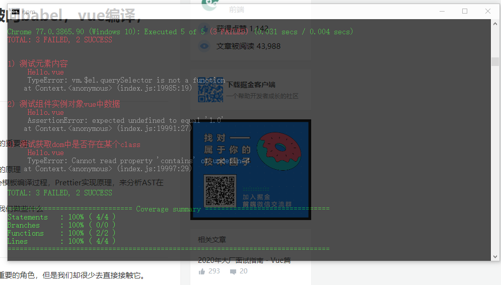

#### 手动实现简易vue-cli项目骨架

#### 目标，通过webpack4.x，集成相关自动化需要的工具、接入项目业务逻辑需要的相关插件、制定目录、文件、代码开发规范，实现以下问题
   - ES6/7/8/9等高级语法转换成ES5
   - stylus/less/scss等css预处理器转换成css
   - 解析字体font、图片(jpg、png...)等静态资源,打包生成静态资源文件夹存放静态资源
   - 压缩js、css等文件，打包生成css文件夹存放压缩压缩过css文件
   - 自动添加css各大浏览器厂商前缀
   - 定义环境变量env :多环境的打包区分.env
   - 抽离公共代码 : TODO:
   - 项目热更新和懒加载
   - 使用webpck-merge将wepack的配置分成两个模式(dev|prod)+一个基础模式(common)，共三个配置文件，其中webpack.common.js由dev和prod配置文件分贝共享
   - 每次打包删除上一次打包记录
   - webpack识别.vue文件，实现.vue文件开发vue项目
   - 集成VueRouter，封装配置实现路由权限控制
   - 集成Vuex,封装，实现全局姿态管理
   - eslint规则
   - 集成Mock.js，模拟交互过程，提升交互效率
   - 使用Pomise和async await 进行异步处理
   - 自动化单元测试环境
   - 打包、自动部署
   

#### 开发环境
  - vscode 安装webpack插件，快速生成配置文件
  - node 版本:v12.1.0     
  - webpack版本:v4.42.1 
  - webpack-cli版本:v3..3.11

#### 目录、文件组织、命名规范  
1. 公共组件、指令、过滤器（多于三个文件以上的引用）将分别存放src目录下的
- components; 
- directives; 
- filters
2. 以使用场景命名Vue页面文件
3. 当页面文件具有私有组件、指令和过滤器时，则建立一个与页面同名的目录，页面文件更名位index.vue,将页面与相关依赖文件存放在一起
4. 目录由全小写的名词、动名词或分词命名，由两个以上的词组成，以“·”进行分隔
-  Vue 文件统 以大驼峰命名法命名，仅入口文件 index ie 采用小写。
- 测试文件 律以测试目标文件名 .Sp 命名
- 资源文件 律以小写字符命名，由两个以上的词组成，以“－”进行分隔

#### 简单说明
- 初期搭建脚手架之配置摸索
配置过程先从一个独立的配置文件开始：build/webpack.config.js，配置相关的loader以及webpack-plugins，实现上述的大部分需要的功能，以打包生产环境包为演示基础

- 配置完善阶段
1. 抽离webpack配置文件
由于生产环境、开发环境webpack的配置不同，虽然可以利用写一个配置文件利用PROCESS_NODE_ENV区别，但是项目变大的话，配置文件代码也会越来越多，区别的地方也会越来越多，不好维护，所以分别创建：common/dev/prod三个webpack配置文件，在packjson里面分别使用不同的打包命令来执行不同的配置文件
2. 构建vue单页面应用程序集成vueRouter还有Vuex


#### 搭建过程

- 配置初期,build/webpack.config.js走天下

  1. 配置babel，安装如下模块
  ```
  1. babel-loader : 将es6等高级语言语法转换成能让浏览器能够解析的低级语法,webpack集成使用的是baber-loader插件，不是babel-cli，cli本身是一个命令行工具
  2. @babel/core 是babel的核心模块，编译器，提供转换api
  3. @babel/preset-env 可以根据配置文件的目标浏览器或者运行环境来自动将es6的代码转es5
  ```
  注意babel-loader之后将es6/7/8等高级语法转换为es5语法，但是对新api并不会转换。比如promise、iterator，set，proxey，symbol等全局对象。以及一些定义在全局对象上的方法比如Object.assing都不会转码。此时我们必须要使用babel-polyfill,为当前环境提供一个垫片。打包后项目会有一些由babel-polyfill提供的代码
  ps：有些工具直接在对应的文件里面输出一些代码这也是打包后生成的bundle.js文件比较大的原因

  2. 执行打包之后，打包文件里含有大量重复的代码，我们需要提供统一的模块化helper来减少这些helper函数的重复输出
  ```js
  npm install @babel/runtime @babel/plugin-transform-runtime -d
  ```
  @babel/runtime就是提供统一的模块化helper，使用能大大减少打包后的编译体积
  @babel/plugin-trasfrom-runtime它会帮助我们自动动态require @babel/runtime中的内容
  注意：还有一些常见的babel:
    @babel/plugin-proposal-decorators将es6+中更高级的特性转化---装饰器
    @babel/plugin-proposal-class-properties将es6中更高级的API进行转化---类

3. 最后在webpack.config.js配置参数module里面导入babel-loader，配置其相应插件即可，如下
```js
module: { // 模块，在webpack中所有文件皆为模块，解析css、js、图片以及字体图标等资源文件
        rules: [
            // 配置babel es6 -》 es5
            {
              test: /\.jsx?$/,
              use:{
                  loader:'babel-loader', // 把es6转es5,只能转一部分高级语法，对于高级的全局方法等没有办法，所以需要扩展babel插件
                  options:{
                      presets:[
                          '@babel/preset-env' // 针对特定浏览器生成es5
                      ],
                      plugins: [
                          
                              [
                                "@babel/plugin-proposal-decorators", //将es6更高级的特性转化 装饰器
                                {"legacy":true}
                              ],
                              [
                               "@babel/plugin-proposal-class-properties", // 将es6更好及api进行转化---类
                               {"loose":true}   
                              ],
                              [
                                  "@babel/plugin-transform-runtime"
                              ]
                              
                          
                      ]
                  }
              }
            }
        ]
    },
```
至此，项目就可以使用es6/7/8/9大部分的特新和api了，打包之后就可以自动转码

4. stylus/less/scee等css预处理器转换成css

- 在项目src目录中添加index.less 文件，并在index.js文件中引入
- 安装相关依赖
```
npm install stylus stylus-loader less less-loader sass-loader node-sass css-loader style-loader -D
    
    css-loader主要的作用是解析css文件, 像@import等动态语法
    style-loader主要的作用是解析的css文件渲染到html的style标签内
    stylus、less、sass是CSS的常见预处理器
    stylus-loader、less-loader、sass-loader主要是将其对应的语法转换成css语法
```
webpack.config.js配置如下，项目只使用到了less
```js
// 配置 css解析以及相关css预处理器转换成css
            {
                test:/\.less$/, 
                use:[
                    {
                        loader: 'style-loader'
                    },
                    {
                        loader:'css-loader'
                    },
                    {
                        loader:'less-loader'
                    }
                ]
            }
```
5. 添加postcss插件
> CSS3 的许多特性来说，需要添加各种浏览器兼容前缀，开发过程中，这样加太麻烦，postcss 帮你自动添加各种浏览器前缀
> postcss-loader同babel-loader一样具有许多相关依赖的插件，支持扩展丰富功能。比如如果要自动添加浏览器前缀，你需要给他配置autoprefixer，还有很多其他功能比如px转rem等等依赖插件
```
npm install postcss-loader autoprefixer -D
    
    postcss-loader autoprefixer 处理浏览器兼容,自动为CSS3的某些属性添加前缀
复
```

6. 解析字体font、图片等静态资源
项目中通常会使用到图片、字体等静态资源，不使用对应的loader项目回报错
```
npm install file-loader url-loader -D
    
    file-loader可以用来帮助webpack打包处理一系列的图片文件；比如：.png 、 .jpg 、.jepg等格式的图片。打包的图片会给每张图片都生成一个随机的hash值作为图片的名字
    url-loader封装了file-loader,它的工作原理：1.文件大小小于limit参数，url-loader将会把文件转为Base64；2.文件大小大于limit，url-loader会调用file-loader进行处理，参数也会直接传给file-loader
```

7. 压缩打包后的js、css
> 由于项目打包后会生成很多js文件，代码之间会有很多空格、引号等，如果我们将其去掉，这样会大大减少打包的体积
> 安装相关依赖
```js
    npm install mini-css-extract-plugin -D // 生产环境下打包后使得多个css资源统一放在一个文件下
    npm install optimize-css-assets-webpack-plugin -D // 用于打包后压缩css代码以及去除注释
    npm install uglifyjs-webpack-plugin -D // 用于压缩js代码
```
> 注意这些都是属于`webpack-plugins`所以需要在配置文件里面的plugins选型里面为webpack进行扩展
配置文件
```js
const MiniCssExtractPlugin = require('mini-css-extract-plugin');
const OptimizeCssAssetsPlugin = require("optimize-css-assets-webpack-plugin") 
```
```js
   // 配置 css解析以及相关css预处理器转换成css、以及支持css新特性、自动浏览器前缀等功能的postcss、生产环境下对css文件进行压缩
            // .css文件
            {
                test: /\.css$/,
                use : [
                    process.env.NODE_ENV === 'development' ? 'style-loader': MiniCssExtractPlugin.loader, //TODO:MiniCssExtractPlugin使用配置
                    { loader: "css-loader" },
                    {
                        loader:'postcss-loader',
                        options:{
                            plugins:[
                                require('autoprefixer')
                            ]
                        }
                    }
                ]
            },
            // .less文件
            {
                test:/\.less$/, 
                use:[
                    process.env.NODE_ENV === 'development' ? 'style-loader': MiniCssExtractPlugin.loader, //TODO:MiniCssExtractPlugin使用配置
                    {
                        loader:'css-loader'
                    },
                    {
                        loader:'postcss-loader',
                        options:{
                            plugins:[
                                require('autoprefixer')
                            ]
                        }
                    },
                    {
                        loader:'less-loader'
                    },
                    
                ]
            },
```
```js
   plugins: [ //插件，用于扩展webpack功能
        // 配置MiniCssExtractPlugin插件用于打包时把多个css资源放在一个独立文件，需要在这里单独为webpack扩展这个插件，制定输出路径
        new MiniCssExtractPlugin({
            filename: "css/common.css",
        }),
        new OptimizeCssAssetsPlugin({ // 用于压缩css代码
            assetNameRegExp: /\.(css|less)$/,
            cssProcessorPluginOptions:{
                presets:['default',{discardComments:{removeAll:true}}]
            },
        })

    ]
```
8. 关于index.html模板和打包生成index.html文件
> 需要提供一个模板页面给webpack，我们是单页面脚手架，所以只需要一个html文件模板作为内容承载

需要安装的依赖如下：
```
    npm install html-webpack-plugin -D
    
    html-webpack-plugin主要有两个作用: 1、为html文件中引入的外部资源如script、link动态添加每次compile后的hash，防止引用缓存的外部文件问题。2、可以生成创建html模板(入口文件)
```
[html-webpack-plugin](https://blog.csdn.net/zhaoruda/article/details/74859338)

```
 npm install clean-webpack-plugin -D
 clean-webpack-plugin是删除webpack打包后的文件夹以及文件 ，注意使用的时候不用传参数一般是生产环境需要
```
配置文件
```js

        new HtmlWebpackPlugin({

            filename: 'index.html',

            template: 'index.html',

            inject: true // js文件至于底部

        }),
```

---

到这里我们打包可以生成带有index.html文件的dist目录了，然后看看我们的webpack.config.js也越来越大了。此时我们也没有怎么区分开发环境和生成环境下的不同配置，接下来就是根据开发环境和生产环境的不同需求，分别创建webpack配置文件

使用webpack-merge将配置文件拆分为3个文件
- webpack.common.js:  
> 存放公共配置，使用webpack-merge分别导入到prod和de配置文件
- webpack.product.js: 开发环境版本
> 主要配置热加载，方便调试，配置针对css文件不同于生产环境版本的处理loader，开发环境下css、js都不需要压缩方便debug不用说的，开发环境下使用style-loader使得全局css以style标签内联的方式载入index.html 配置服务器代理解决跨域问题等等
- webpack.dev.js: 生产环境环境版本
> 打包压缩css、js、html代码；css、js资源文件使用20位hash方式命名方便打包获取最新版本，提取公代码，对js代码进行分割...

在package.json文件配置不同的打包命令，如下
```json
"scripts": {
    "test": "echo \"Error: no test specified\" && exit 1",
    "build": "webpack --config ./webpack.prod.js",
    "dev": "webpack-dev-server --config ./webpack.dev.js"
  },
```

9. webpack识别.vue文件实现
> 目前绝大多数的vue项目里核心业务代码都是.vue文件结尾的，但浏览器不支持对.vue文件的解析，故需webpack将.vue文件转换为浏览器能识别的js文件。
```
npm install vue-loader vue-template-compiler cache-loader thread-loader -D
    npm install vue -S
    
    vue-loader 作用解析.vue文件
    vue-template-compiler 作用编译模板
    cache-loader 作用缓存loader编译的结果
    thread-loader 作用使用 worker 池来运行loader，每个 worker 都是一个 node.js 进程
    vue 一个用于构建用户界面渐进式的MVVM框架
```
安装用于解析、编译.vue文件、模板一些列插件，以及安装我们的开发的使用到的框架——前端主流mvvm框架之一vue.js，这个不用说了，本项目就是仿vue-cli脚手架，这些东西必不可少。如果以后在此扩展可以真正构建一个满足某领域业务开发需求的前端项目开发框架，比如中后台管理系统业务框架，当然还很远

10 Vue集成VueRouter和Vuex

- 安装相关依赖
```
    npm install vue-router vuex -S
    vue-router是 Vue.js 官方的路由管理器。它和 Vue.js 的核心深度集成，让构建单页面应用变得易如反掌
    vuex是一个专为 Vue.js 应用程序开发的状态管理模式
```
- 集成vue-router
> vue-router配置以及实现路由权限控制

- 集成vuex
> vuex全局封装实现应用程序的全局姿态管理

11. 自动化单元测试环境
> 实现类似vue那样的自动化单元测试环境，对`.js`、`.vue`组件进行自动化单元测试
- 工具链：Karma + Phantom + Mocha  + Chai + 接入webpack（webpack用于打包，并将打包后的源码交给karma进行单元测试）
- Element的单元测试工具Util.js
- 测试效果

- 简单搭建过程
关于从0搭建自动化单元测试环境，可以看另一个github项目[link](https://github.com/LXY-1/auto-unit-test),这里主要不同是它集成在项目里面作为项目框架的单元测试工具(不是很完善，但是vue项目基本够用，支持js模块以及.vue组件单元测试，只要会编写单元测试即可以)，除了支持使用es6\7\8\9这些特性编写的js模块进行单元测试之外，还支持.vue组件进行单元测试
- 踩坑
 vue.js 对`template`模板进行解析是使用`complai.js`，在单元测试封装的全局插件`util.js`导入的`Vue`指向了不带`complair.js`的`common.js`所以无法渲染我们传递的`template`模板。导致插件vue实例后无法通过`$em`获取dom元素。
使用Istanbul插件统计代码覆盖率，在webpack以及karma.conf分别配置，但是接入vue组件单元测试后报错（测试js文件不会）查阅文档教程提示需要在`vue-loader`，`ooptios`选项配置如下
```js
  loaders: {
    'js': 'istanbul-instrumenter-loader' // 注意了，使用istanbul-instrumenter-loader收集代码覆盖率，需要对.vue文件单独配置js loader
 }
```
配置好了之后，覆盖率可以正确显示了，但是与`vue-loader`加载器发生冲突，import的.vue组件无法被正常解析成一个vue组件对象Component，尝试无果，打算换一种生成覆盖率的方式。
6. 关于Mocha、Chai
mocha是前端自动化测试框架，提供了不同风格断言库的兼容，测试用例分组，同步、异步测试架构，生命周期钩子等能力。
```js
describe('功能测试',function(){
    // 同步代码测试
    describe('同步功能',function(){
        it('1 + 2 = 3',function(){
            // 调用相关代码及设置断言
        })
    });
    // 异步代码测试
    describe('异步功能',function(){
        it('某个变量的值应该是数字',function(done){
            // 调用相关代码及设置断言
            // 手动调用done()表示异步结束
        })
    });
    // mocha hooks
    before(function() {
    // runs before all tests in this block
    });
    after(function() {
        // runs after all tests in this block
    });
    beforeEach(function() {
        // runs before each test in this block
    });
    afterEach(function() {
        // runs after each test in this block
    });
})
```
Mocha测试框架不包括断言，所以使用Chai作为断言库，支持expect，assert、should断言语法
```js
expect(bar).to.not.exist;// 断言变量bar不存在
expect(data).to.have.ownProperty('length');// 断言data有length属性
expect(name).to.be.a('string');// 断言name是一个字符串
assert.equal(value1,value2);// 断言value1和value2相等
```


